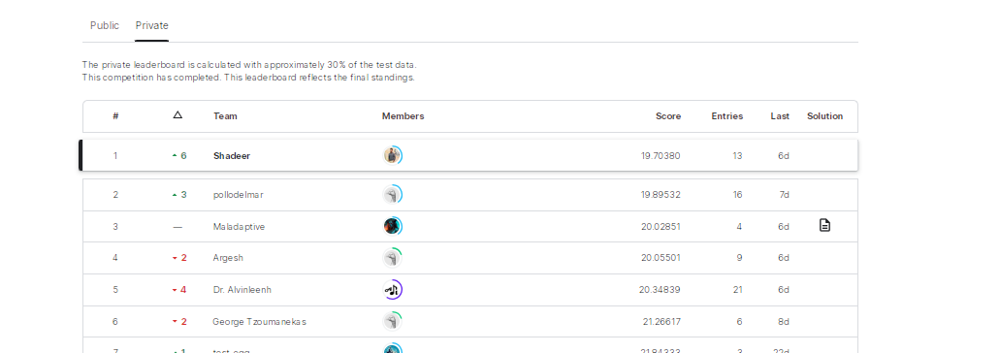

# Kaggle Egg Sales Forecasting Challenge 2023 - Model Documentation

## Topped on the Leaderboard

## Overview
This repository contains the machine learning model that secured a top position on the private leaderboard of the Kaggle Egg Sales Forecasting Challenge. The challenge was to predict daily egg sales for the year 2022 using a dataset that spanned 30 years of sales from a shop in Sri Lanka.

## Challenge Description
The dataset provided a fascinating glimpse into the ebb and flow of egg sales influenced by various factors including cultural festivals, global events, and seasonal changes. Participants were tasked with forecasting egg sales for the entire year of 2022, with the model's performance being evaluated using the Root Mean Squared Error (RMSE) metric.

## Model Details
This section should include:
- A high-level description of the machine learning model and algorithms used.
- Any feature engineering or data preprocessing steps.
- Insights gained during the exploratory data analysis phase.

## Results
Our model achieved an RMSE of X.XX on the private leaderboard, which was one of the top scores. This success can be attributed to a combination of innovative data preprocessing, a robust model architecture, and meticulous parameter tuning.

## Usage
Instructions on how to run the model, including environment setup and execution steps.

## Files in the Repository
- `egg-price-prediction.ipynb`: The main script used to train the model.
- `data/`: Directory containing the dataset files (not included in this repository due to the dataset's size and licensing).

## Feel free to Contribute
If you'd like to add a notebook or improve an existing one, please feel free to submit a pull request!